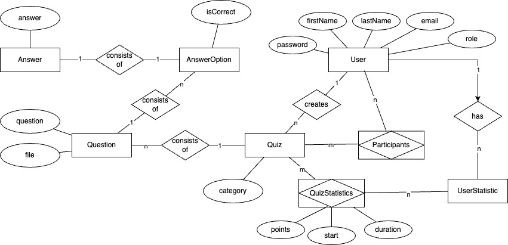

# Backend Web Engineering

This is the template project for the BWENG course.

## Requirements

* Docker
    * [Get Docker](https://docs.docker.com/get-docker/)

## Container

* Spring Boot basic setup container
  * Port 8080
* MariaDB container
  * Port 3306

## Component Diagram


## Already installed dependecies

## Setup

```shell
docker run -p 127.0.0.1:3306:3306 --name quiz23 -e MARIADB_ROOT_PASSWORD=quiz23 -d mariadb:latest 
```

```shell
docker exec -it quiz23 mariadb -u root -p
```

```shell
create database quizapplication;
```
